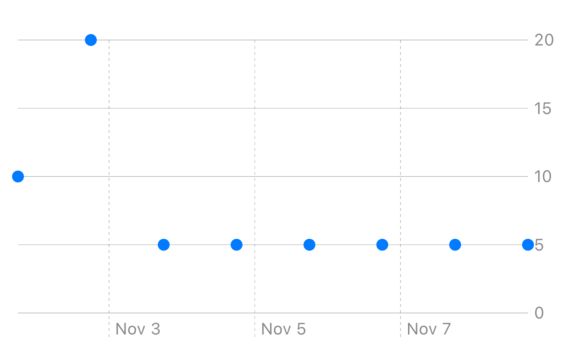

# PDF発表用HTMLスライド構成案

## 概要

`presentation_structure.yaml`を元に、PDF発表用の静的HTMLスライドを作成します。

## ファイル構成

```
slides/html/
├── README.md           # この構成案ファイル
├── presentation.html   # 全スライド統合HTMLファイル
├── styles.css          # 印刷・表示用スタイル
└── images/             # 画像格納フォルダ
    ├── image1.png      # デフォルトのグラフ表示
    ├── image2.png      # AxisGridLineのみの表示
    ├── image3.png      # 完全な要素復元後の表示
    └── image4.png      # 1日おき表示の結果
```

## 技術仕様

### HTML構造
- **全スライド一体型**: 1つのHTMLファイルに全10スライドを統合
- **セマンティックHTML5**: 適切なタグで構造化
- **スライドタイプ別セクション**:
  - `<section class="slide slide-title">` - タイトルスライド
  - `<section class="slide slide-content">` - コンテンツスライド
  - `<section class="slide slide-code">` - コードスライド
  - `<section class="slide slide-summary">` - まとめスライド
  - `<section class="slide slide-qa">` - 質疑応答スライド

### CSS設計
- **印刷最適化**: `@media print`でPDF変換に最適化
- **レイアウト**: CSS Grid/Flexboxで各スライドタイプを設計
- **タイポグラフィ**: 読みやすいフォント設定
- **カラーパレット**: iOS開発者向けのクリーンなデザイン
- **ページブレーク**: 各スライドが1ページに収まる設計

## スライドタイプ別設計

### 1. Title Slide (slide-title)
```html
<section class="slide slide-title">
    <h1>Swift Charts の軸に良い感じで日時を表示する</h1>
    <p class="author">発表者: [発表者名]</p>
    <p class="date">日付: [発表日]</p>
</section>
```

### 2. Content Slide (slide-content)
```html
<section class="slide slide-content">
    <h2>問題提起・導入</h2>
    <ul>
        <li>Swift Chartsで簡単にグラフを作成できる</li>
        <li>細かい調整にはAPIの理解が必要</li>
        <li>ドキュメントだけでは不明な点が多い</li>
        <li>今回の目的: ラベル調整の実例紹介</li>
    </ul>
</section>
```

### 3. Code Slide (slide-code)
```html
<section class="slide slide-code">
    <h2>データ構造の紹介</h2>
    <div class="slide-content">
        <div class="description">
            <ul>
                <li>今回使用するデータ構造</li>
                <li>時刻と回数を保持するシンプルな構造</li>
            </ul>
        </div>
        <div class="code-block">
            <pre><code class="swift">
struct Record: Identifiable {
    var id: UUID = UUID()
    let date: Date
    let count: Int
}
            </code></pre>
        </div>
        <div class="image-container">
            
        </div>
    </div>
</section>
```

### 4. Summary Slide (slide-summary)
```html
<section class="slide slide-summary">
    <h2>まとめ</h2>
    <ul>
        <li>小さな日時範囲: 自動調整で十分</li>
        <li>広い日時範囲: 手動設定が必要</li>
        <li>細かい表示要求: コードでの適切な設定</li>
        <li>推奨: AxisMarks(values: .stride(by:, count:))の活用</li>
    </ul>
</section>
```

### 5. QA Slide (slide-qa)
```html
<section class="slide slide-qa">
    <h2>質疑応答</h2>
    <p class="qa-text">ご質問をお受けします</p>
</section>
```

## スタイル設計方針

### 印刷用設定
```css
@media print {
    .slide {
        page-break-after: always;
        width: 100%;
        height: 100vh;
        margin: 0;
        padding: 2rem;
    }
    
    .slide:last-child {
        page-break-after: avoid;
    }
}
```

### コードハイライト
```css
.code-block {
    background-color: #f8f9fa;
    border-radius: 8px;
    padding: 1.5rem;
    margin: 1rem 0;
    font-family: 'Menlo', 'Monaco', 'Consolas', monospace;
    font-size: 0.9rem;
    line-height: 1.4;
}

.swift {
    color: #333;
}
```

### レイアウト
```css
.slide-code .slide-content {
    display: grid;
    grid-template-columns: 1fr 1fr;
    gap: 2rem;
    align-items: start;
}

.slide-code .image-container {
    text-align: center;
}

.slide-code img {
    max-width: 100%;
    height: auto;
    border: 1px solid #ddd;
    border-radius: 4px;
}
```

## 実装の流れ

1. **HTML作成**: `presentation.html`に全スライドを統合
2. **CSS作成**: `styles.css`で印刷最適化スタイル
3. **画像配置**: `images/`フォルダに必要な画像を配置
4. **PDF変換**: ブラウザの印刷機能でPDF生成

## PDF変換方法

1. ブラウザで`presentation.html`を開く
2. 印刷プレビューを開く（Ctrl+P / Cmd+P）
3. 設定:
   - 用紙サイズ: A4
   - 余白: 最小
   - 背景グラフィック: 有効
   - 印刷先: PDFとして保存

## 注意事項

- 画像ファイルは実際の画像と差し替えが必要
- フォントは印刷に適したものを選択
- 各スライドが1ページに収まるよう調整
- コードの可読性を重視したスタイル設計

## 今後の拡張

- 発表者ノート機能の追加
- 複数のカラーテーマ対応
- レスポンシブデザインの強化